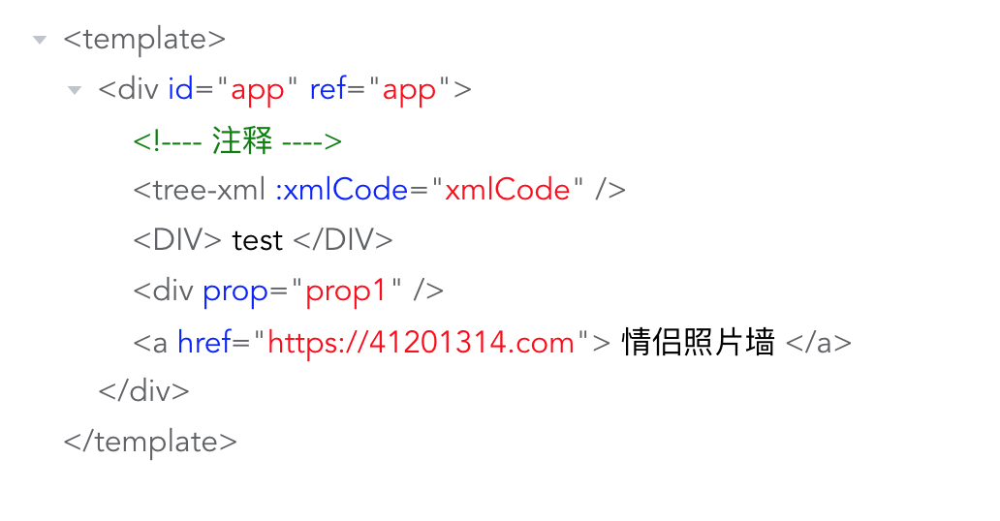

# tree-xml
## 说明
tree-xml是一个树形xml代码查看器，利用element-ui中的tree组件与htmlparser2把xml代码以树视图展示，可自定义元素标签、属性、文本等样式

## 通过NPM安装
```
npm i tree-xml -S
```

### 引入组件
```
import 'tree-xml'
import 'tree-xml/dist/tree-xml.css'
```

### 预览


### 使用
```
<template>
  <div id="app">
    <tree-xml :xmlCode="xmlCode"></tree-xml>
  </div>
</template>

<script lang="ts">
import { Component, Vue } from "vue-property-decorator";
import "tree-xml";
import 'tree-xml/dist/tree-xml.css'
@Component({})
export default class App extends Vue {
  xmlCode = `
    <template>
      <div id="app" ref="app">
        <!---- 注释 ---->
        <tree-xml :xmlCode="xmlCode"></tree-xml>
        <DIV>test</DIV>
        <div prop="prop1"></div>
        <a href="https://41201314.com">情侣照片墙</a>
      </div>
    </template>`;
}
</script>
```


### Customize configuration
See [Configuration Reference](https://cli.vuejs.org/config/).
